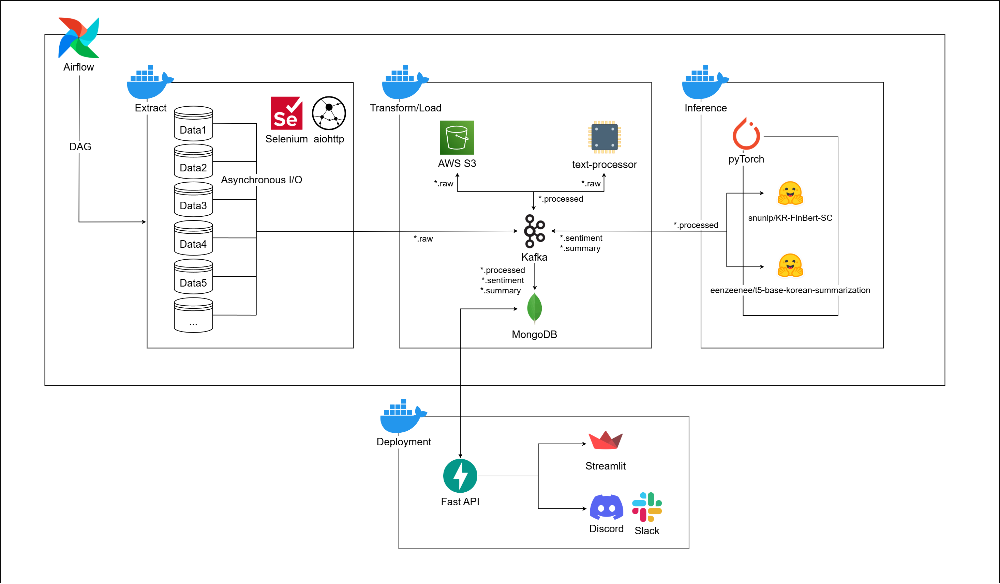
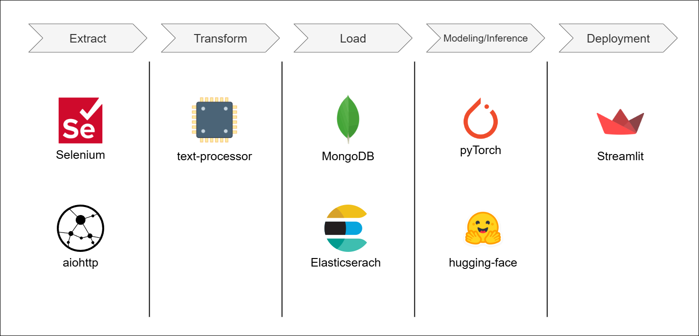

# news-pipeline

## System-Architecture

<div>
    
</div>

<br>

## Tech Stack
*   **Data Ingestion & Streaming**
    *   `Kafka`: 실시간 뉴스 데이터 스트리밍 및 이벤트 처리 플랫폼

*   **Data Orchestration**
    *   `Airflow`: 데이터 수집, 처리, 적재 파이프라인의 스케줄링 및 관리

*   **Data Processing & Model Inference**
    *   `PyTorch`, `Hugging Face Transformers`: NLP 모델(Mecab을 사용한 키워드 추출, 감성 분석, 문서 요약 등)의 추론

*   **Data Storage**
    *   `MongoDB`: 수집된 뉴스 기사, 분석 결과 등 NoSQL 데이터 저장
    *   `Elasticsearch`: 검색 및 집계 기능을 위한 데이터 저장 (필요시 추가)

*   **API Server**
    *   `FastAPI`: 저장된 데이터 접근 및 외부 서비스 연동을 위한 API 서버

*   **Dashboard & Visualization**
    *   `Streamlit`: 분석된 데이터 및 파이프라인 현황 시각화를 위한 대시보드

*   **Containerization & Deployment**
    *   `Docker`: 각 서비스(수집기, 처리기, API, 대시보드 등)의 컨테이너화 및 일관된 실행 환경 제공
    *   `Docker Compose`: 로컬 환경에서 다중 컨테이너 애플리케이션 정의 및 실행

*   **Infrastructure**
    *   `AWS (Lambda, VPC 등)`: 클라우드 기반 서비스 확장 (구현 예정)
    *   `Kubernetes (k8s)`: 컨테이너 오케스트레이션 (구현 예정)

<br>

## ETL (Data Pipeline Flow)

<div>
    
</div>

**Extract** 
- 웹 크롤링을 통해 다양한 뉴스 소스로부터 기사 데이터를 수집

    - `Selenium`: JavaScript 렌더링이 필요한 동적 웹 페이지에서 데이터를 추출, ex) 특정 카테고리별 인기 기사
      
    - `aiohttp`: 다수의 HTTP 요청을 비동기적으로 처리하여 효율적으로 데이터를 수집
      
        - Semaphore를 활용하여 동시 요청 제어, ex) 5개 

**Transform**
- `text-processor` (내부적으로 `Mecab` 등 활용)
    
    - 수집된 원시 데이터를 정제하고 분석 가능한 형태로 가공
    
    - `Mecab`: 한국어 형태소 분석기, 문장에서 명사를 추출하여 주요 키워드를 식별하고, 검색 용이성을 높임
        

**Load**
- 변환된 데이터를 분석, 검색, 활용이 용이하도록 데이터베이스에 저장

    - `MongoDB`: 추출된 키워드, 감성 분석 결과, 요약문 등 다양한 형태의 데이터를 NoSQL 형태로 저장
    
    - `Elasticsearch`: full-text search 및 집계 기능을 제공하며, Kibana를 통한 시각화의 기반 (구현 예정)

**Modeling/Inference**
- `PyTorch`, `Hugging Face Transformers`

- 전처리된 데이터를 바탕으로 사전 학습된 머신러닝 모델을 사용하여 텍스트로부터 추가적인 정보를 추론

  ex) 기사 내용 기반 감성 분석, 핵심 내용 자동 요약, 주제 분류, 연관 기사 추천 등


**Deployment/Serving**
- 분석된 데이터와 모델 추론 결과를 사용자가 쉽게 확인하고 활용할 수 있도록 제공

- `Streamlit`: 파이프라인의 현황, 분석 결과, 모델 추론 결과 등을 시각적인 대시보드 형태로 제공

- `FastAPI`: 필요에 따라 분석된 데이터나 모델의 추론 기능을 API 형태로 외부에 제공

<br>

## Lambda Architecture


*   **Speed Layer**
    * 최신 데이터를 빠르게 처리하여 실시간 분석 결과를 제공 
    
    ex) RSS feed polling, Kafka Streaming
    
*   **Batch Layer**
    * 전체 데이터셋에 대해 정교하고 포괄적인 분석을 주기적으로 수행 
    
    ex) 시간 단위 비동기 크롤링, `Airflow` 기반 ETL
    
*   **Serving Layer**
    * 스피드 레이어의 실시간 뷰와 배치 레이어의 배치 뷰를 통합

    ex) `MongoDB`, `Elasticsearch` 활용하여 사용자에게 완전한 데이터 뷰를 제공


<br>

## Project Structure

```
news-pipeline/
├── .gitignore                 
├── assets/                    
├── README.md                  
├── docker/                    # 서비스별 Dockerfile 정의
├── docker-compose.yml         # Docker Compose를 이용한 다중 컨테이너 애플리케이션 정의
├── infra/                     # 인프라 구성 관련 파일
│   ├── airflow/               # Apache Airflow 설정 및 DAGs
│   ├── k8s/                   # Kubernetes 배포 설정 (예정)
│   └── kafka/                 # Apache Kafka 설정
├── models/                    # 머신러닝 모델 파일 (PyTorch, Hugging Face 등)
├── requirements.txt           # Python 패키지 종속성 목록
└── src/                       # 핵심 소스 코드
    ├── api/                   # FastAPI를 이용한 DBMS API 서버
    ├── collectors/            # 데이터 수집기 
    ├── common/                # 여러 모듈에서 공통으로 사용되는 유틸리티 또는 설정
    ├── consumers/             # Kafka 등 메시지 큐로부터 데이터를 소비하는 모듈 (MongoDB 등)
    ├── dashboard/             # Streamlit을 이용한 데이터 시각화 대시보드
    ├── database/              # 데이터베이스 관련 로직 (MongoDB 등)
    └── processors/            # 데이터 처리 및 변환 모듈 (키워드 추출, 감성 분석, 문서 요약)
```

<br>

### Future Enhancements

*   **클라우드 네이티브 아키텍처 전환:** `AWS` 서비스(`Lambda`, `VPC`) 및 `Kubernetes(k8s)`를 활용하여 확장성, 탄력성, 관리 효율성을 갖춘 클라우드 네이티브 환경으로 점진적 전환
*   **데이터 플랫폼 고도화:** `Elasticsearch` 클러스터 최적화, `Kibana` 활용 심화, 데이터 백업/복구 전략 수립 및 `데이터 품질 관리` 시스템 도입
*   **DevOps 및 MLOps 강화:** `CI/CD 파이프라인` 구축, `IaC(Infrastructure as Code)` 확대, 통합 `모니터링 및 로깅 시스템` (`Prometheus`, `Grafana`, `ELK/EFK`) 구축
*   **서비스 안정성 및 보안 강화:** API 보안 강화, 데이터 암호화, 파이프라인 오류 처리 개선 및 정기적인 시스템 점검
